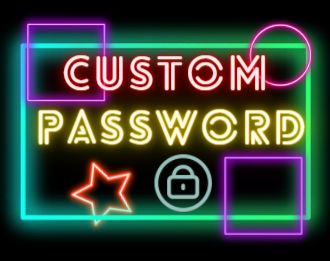
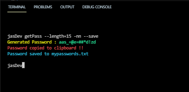
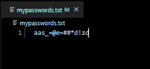

# CustomPassword 🔐

    

## 🚩 Full explanation of the CLI Application in my blog

## Technolgies used :

    

<b><h4>Node.Js packages</h4></b>

- <b>Chalk</b> : for styling of CLI
- <b>Commander</b> : to pass all the options to generate password of our choice
- <b>Clipboardy</b> : to copy the generated password to the clipboard

 

# 🚩What is Custom Password ?

A lot of times while filling forms online we all have come across registration forms that don't allow Google or any other social authentication and prompt the user to add a password to create an account successfully. For that also Google Chrome has a feature of Suggest strong password, but sometimes when you are too dependent on something, then it starts showing its disadvantages. Most users save most of their passwords in their Google Account due to which the Suggest strong password stops coming. To solve that problem I came up with <strong>CustomPassword</strong> built using Node.js which helps you generate a strong password based on your conditions like :

- Length of password
- Composition of password ( whether it should be numeric or alphabetic only or a mix of both or with symbols )

using your own custom made command , we can even copy it to the clipboard and also save it to our local .txt file 🤩

# Preview of the application using custom command

 
    

The same password gets saved my custom named file <b>mypasswords.txt</b>

 
    

## 🏍 To use , view or run the code :

 

- Clone / Download :

       git clone https://github.com/your_username_/Project-Name.git

- Open the project in your favorite code editor and do following

       npm install commander chalk clipboardly

## 📌 Want to try it from scratch ❓
We got you covered , head over to <strong>starterFiles</strong> branch of the repository to download the starter files of the project and get set go !!!  🏍

## ✍ Contributing :

Contributions are what make the open source community such an amazing place to be learn, inspire, and create. Any contributions you make are greatly appreciated.

- Fork the Project
- Create your new Branch <code> git checkout -b NewBranchName </code>
- Commit your Changes <code> git commit -m " Description of contribution you made " </code>
- Push to the Branch <code> git push origin NewBranchName </code>
- Open a Pull Request
